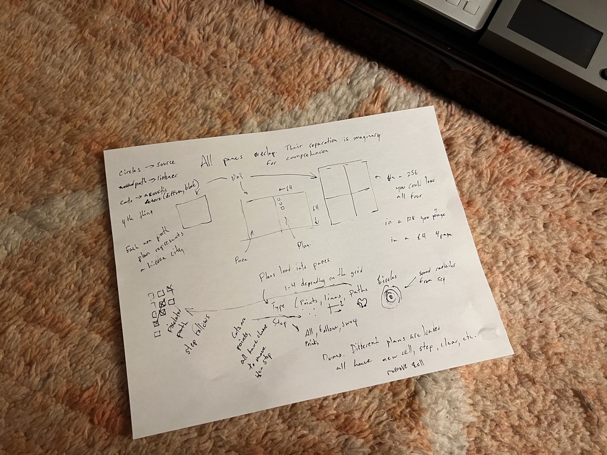
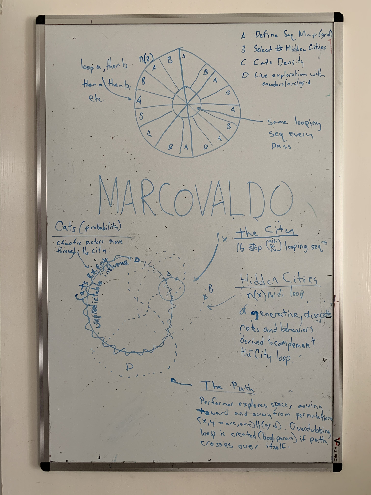

# marcovaldo
a spatial sequencer with cats

## Dev Notes
**(1/20/2024)**
Muddled through implementation of the path follower plan. It was a long week and my attention was split, but it's nice to see this piece in action. The big win in this latest week's worth of effort, aside from the actual goal of completing this view, was clocking the updates and keeping the grid refresh frequent. It was inevitable we'd get there, but now that it's in place it's easier to see the musical outcomes this whole exercise is meant to support.

**(1/12/2024)**
Structure materialized in the shower for a method of laying out the app as a series of disconected 64 pixel layers, each with a purpose and representing an overlapping reality. Built out a few of the low level prototypes and got the arc and grid into an interactive state with most of the abstraction I wanted. Still need Panes.

Created the cat plan and cat symbol so I wouldn't forget, but didn't get far.

**(1/11/2024)**
It was more of a struggle to nail the radians to rings ratio than I'd prefer to admit.

**(1/8/2024)**
Back in November of 2020 I feverishly captured this idea on the whiteboard on my bedroom door (generally used for chores and family notes). 

I forgot about it until finishing a passable draft of [Forge](https://github.com/cachilders/forge/tree/main) and contemplating what to work on next. As a musical instrument idea, Marcovaldo is opaque and nearly incomprehensible to me, now; so it'll be an exercise in imagination and projection into a past personal state to get any semblance of the idea on the whiteboard into reality.

I have some thoughts, though.
- A sequencer programmed in four stages with a arc (something like step, fundamental, substep, harmonic)
- Something something sofcut
- Spatial exploration with a grid
- Non-player cats wandering around, scratching on harmonics and slew

IDK. There's a lot I don't know how to accomplish, so this will be a journey of discovery and hopefully some scope reduction.

Props to [the GOAT](https://en.wikipedia.org/wiki/Italo_Calvino) for [the inspiration](https://en.wikipedia.org/wiki/Marcovaldo)—[past](https://github.com/cachilders/qfwfq), present and future.
