# marcovaldo
a spatial sequencer with cats

## v2
While version 2 introduces a number of expansions of scope, it introduces very few breaking changes (alongside a handful of bug fixes). If you encounter unexpected behavior, please pass it along either here or in an issue in the repository.

Changes are reflected in the documentation below, but can be summarized as:
- Introduction of proper grid step editor
- Introduction of step probability
- Midi and i2c support in addition to mx.synths
  - Ansible
  - Crow (theoretically up to 5, though there are only four sequences)
  - Disting
  - ER-301
  - Just Friends (up to 2)
  - W/Delay (up to 2)
  - W/Synth (up to 2)
- New cats for the new devices (these are sparse at the moment)
- An additional experimental cat (cats are random actors that introduce effects if you're new to this script) that controls W/tape
- More granular per-sequence params (in addition to performer selection), including envelope width modifier, cats enabled or disabled, and performer-specific params

In short, v1 was reflective of a number of choices that made modification for the user more limited. V2 is a major expansion of individual capacity for change and a more powerful mode of sequence construction with expanded voicing options.  

## Usage

Marcovaldo is a sequencer for monome norns. It works best with a varibright monome grid, but it isn't required for basic use. Grids of any size will do. It's also built with the monome arc in mind, but this is not a requirement to enjoy the script.

### The Arrangement
The collection of four sequences at the heart of Marcovaldo is called its Arrangement. The rings, encoders, keys, and console all serve the Arrangement.

### The Console
Marcovaldo's screen provides both aesthetic and functional value. With an arc and a grid, the console is supplemental and largely unnecessary. As such its DEFAULT mode is animation. There are currently three scenes (mushrooms, wasps, and woodcock) suggested by [the text from which the application is adapted](https://en.wikipedia.org/wiki/Marcovaldo). More will come in time.

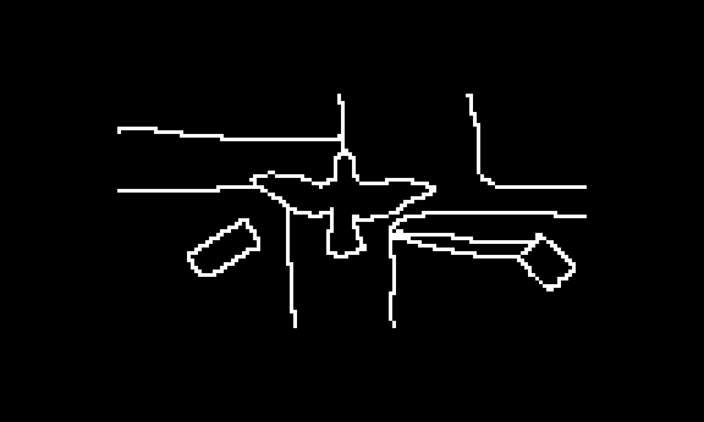

If these animations are not your cup of tea (no hard feelings), they can be disabled in Marcovaldo's global params.

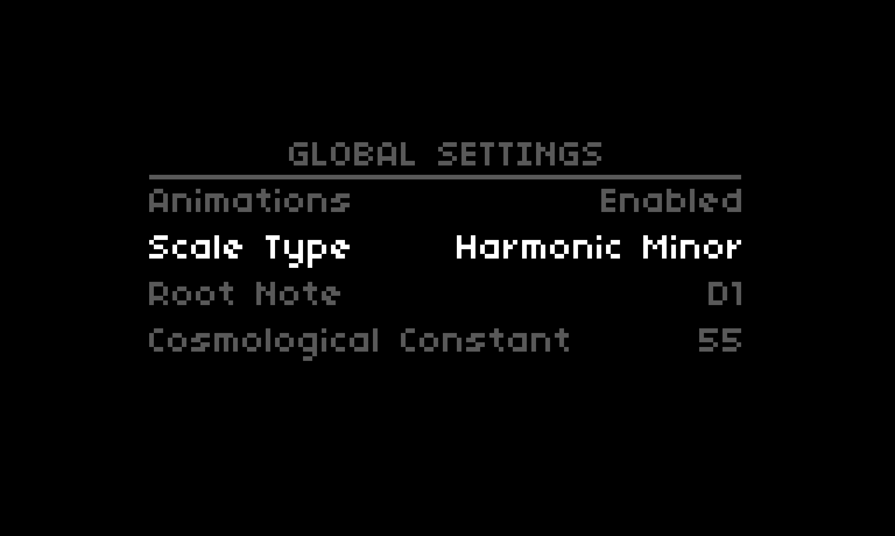

This will replace the animations by default with the sequence status view.

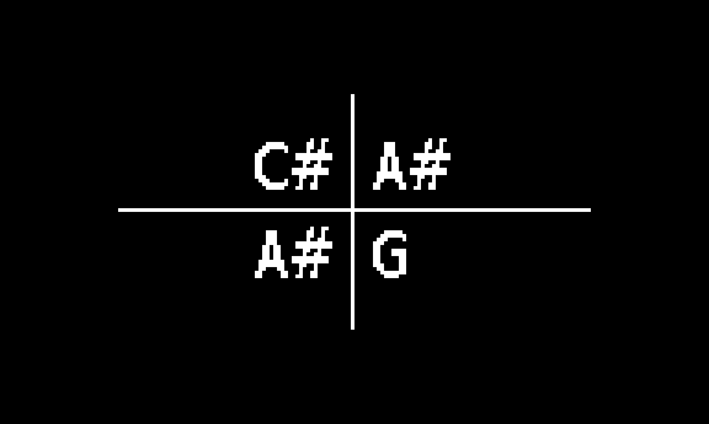

You can toggle between animation and sequence status with ENC 1 at any time while in DEFAULT mode (unless animations have been disabled).

There are two edit modes.

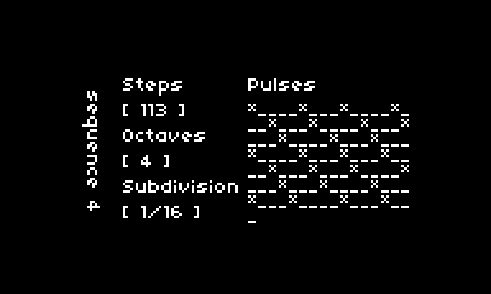

SEQUENCE allows for the editing of STEP COUNT (ARC 1 / ENC 2), PULSE COUNT (ARC 2 / ENC 3), OCTAVE RANGE (ARC 3 / K1 + ENC 2), and CLOCK SUBDIVISION (ARC 4 / K1 + ENC 3).

Pulses derived by PULSE COUNT and STEP COUNT are distributed by euclidean distance automatically when these attributes are changed.

From the DEFAULT mode, enter the SEQUENCE edit mode by pressing K3. The selected sequence can be changed using ENC1. Alternately, from DEFAULT mode you can press K1 and twist any of the four arc knobs to enter edit mode on the respective sequence. K2 will return to the DEFAULT mode. K3 will drop you from SEQUENCE edit mode to STEP edit mode.

Within SEQUENCE mode, the grid will reflect pulse rates above a probability of zero. 64 key grids will represent 128 steps across two pages, using the same three finger paging gesture to flip. The first page represents the first 64 steps, the second, the remainder.

While the length of the sequence can be adjusted by ARC 1 or ENC 1, it can also be adjusted by pressing K1 and a key on the grid. This will either expand or contract the length within the 128 step limit.

Tapping any key within the sequence range while in SEQUENCE will toggle the pulse for that step. nb: Toggling off a pulse in this way will not preserve the probability should you toggle the pulse back on. The toggle deals in absolutes.

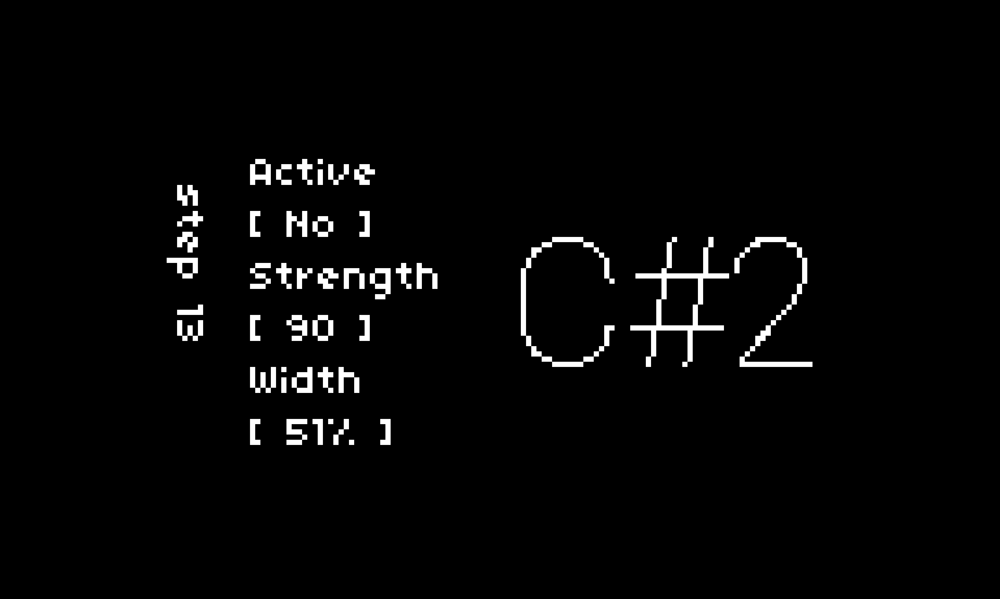

In addition to pressing K3 from SEQUENCE mode to enter STEP mode, you can long-press any grid key within the sequence range to enable momentary editing of the respective step.

STEP allows for the editing of NOTE (ARC 1 / ENC 2), PULSE PROBABILITY (ARC 2 / ENC 3), PULSE STRENGTH (ARC 3 / K1 + ENC 2), and PULSE WIDTH (ARC 4 / K1 + ENC 3).

PULSE PROBABILITY is an override. Additive and subtractive adjustments persist when recalculating euclidean beats. PULSE WIDTH is a multiplier applied to the clock/subdivision calculated duration of the sequence's pulse. The range is between 50% anf 150% of the original pulse duration.

Pressing K2 in STEP mode will return you to the parent SEQUENCE. Another K2 press will exit SEQUENCE.

The selected step can be changed with ENC 1, or by long-pressing another step in the grid.

### The Chart

While the Arrangement more or less represents the "sequencer" part of Marcovaldo, it also represents the working order of the world. The Chart, on the other hand, reflects a way of observing and interacting with that world.

It's the grid. You don't need it to experience the music, but something is lost without one in your ability to connect to it.

The Chart is divided into four sections. If your grid is a 256, you'll see all four at once. If not, you'll move between them with the page gesture.

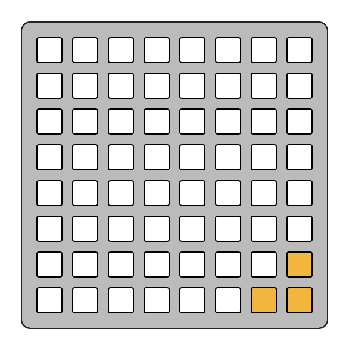

Each of the first three Chart plans (RADIATION, PATH, CATS) contains both FEATURES and PHENOMENA. FEATURES are stable aspects of the environment. PHENOMENA represent the ephemera of their affect on the environment. The fourth plan (RELIEF) is only PHENOMENA.

The key distinction is FEATURES can be created or moved or otherwise interacted with. PHENOMENA occur.

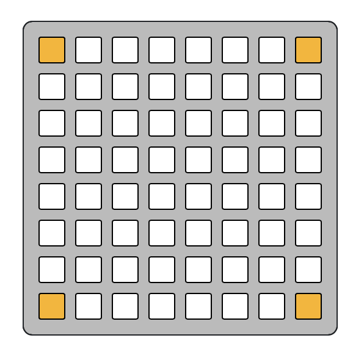

The RADIATION plan ("Moon and GNAC") contains the emitters (FEATURES) of the four sequences, illustrating the intensity and frequency of its output (PHENOMENA).

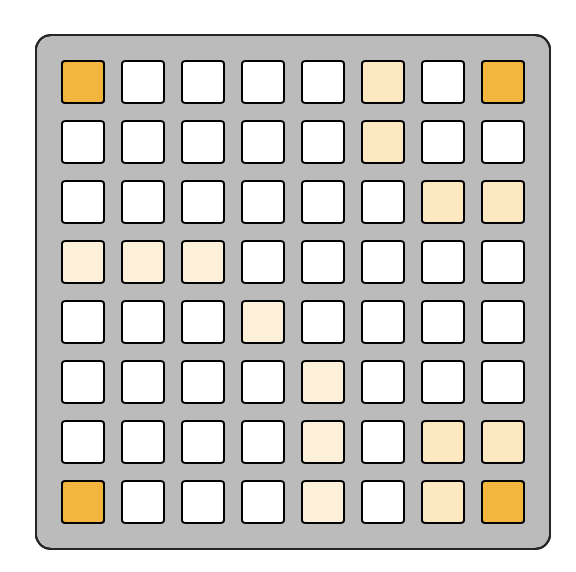

Hold a press on one of the emitters while pressing a new key to change its position. These features cannot be removed, only moved and stopped.

Tap an emitter to enable or disable its associated sequence.

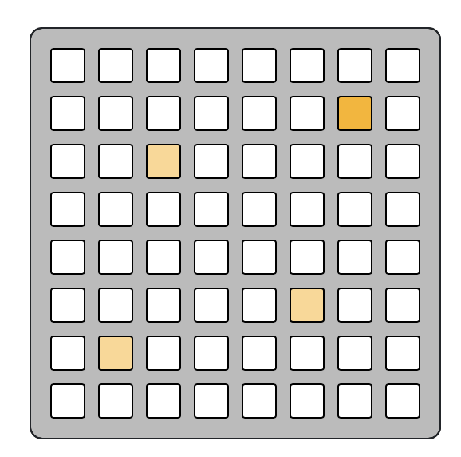

The PATH plan ("The City All to Himself") is the core of the "spatial" claim of this software. Placing markers on this plan (FEATURES) allows Marcovaldo (the observer) to move between them (PHENOMENON). Where Marcovaldo is in space in relation to the various emitters alters the intensity with which he hears their emanations.

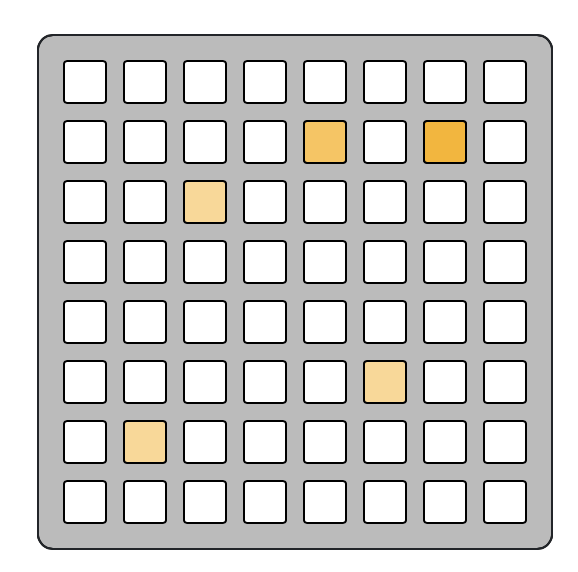

New presses automatically add to the tail of his path, however by holding a press on any marker within his path you can inject a new stop from that selected point. Tapping any marker without holding to inject a new one will remove it from the path.

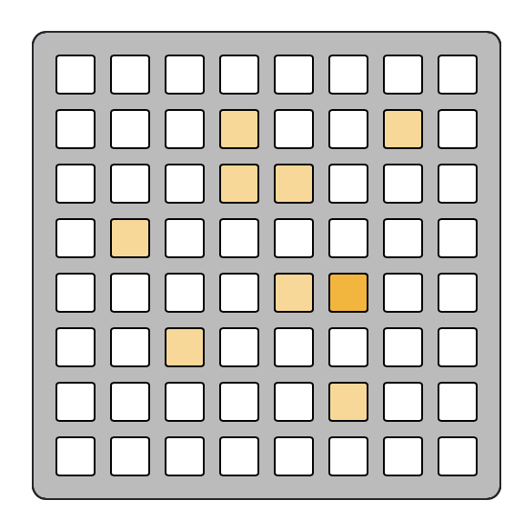

The CATS plan ("The Garden of Stubborn Cats") introduces minor chaos to the orderly world of the arrangement. Tap anywhere to add or remove cats (FEATURES). Each has a variable amount of laziness that will determine the frequency with which it moves (PHENOMENA).

When they walk off the Chart, they're gone for good. When they do move, they modify the characteristics of the sound in that instance. On some occasions these changes will stick. Different voices will reflect these changes differently.

Cats do not care if any sequences are playing. Cats continue to move in silence and are happy being cats.

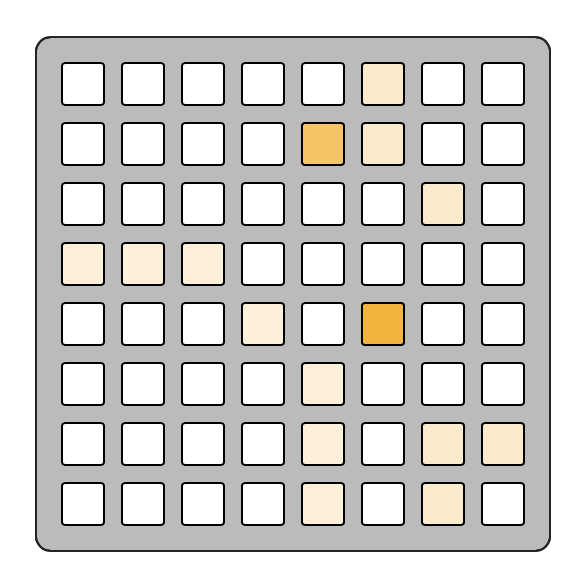

The final plan is the RELIEF ("Smoke, wind, and Soap Bubbles"). It is a collection of all the Chart phenomena layered atop one another. A visualization of how all the pieces fit together with no interactive characteristics.

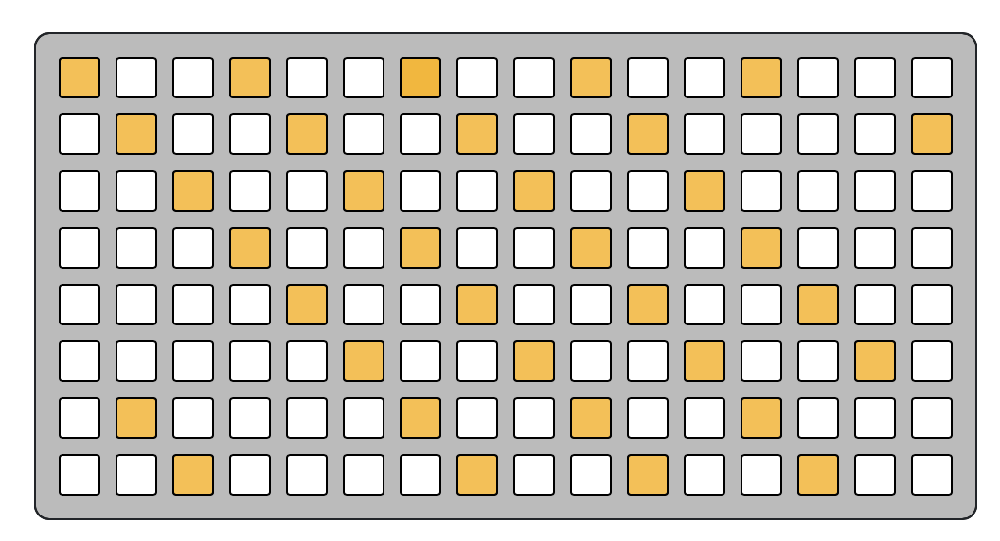

The SEQUENCE SHEET is an overlay that will cover the chart plans while in SEQUENCE or STEP. K2 will return you to the standard chart view from SEQUENCE. Likewise, the SHEET will time out eventually and restore the DEFAULT mode.

### Params
SAVING and LOADING from Marcovaldo's global parameter group will save and load not only the feature placements on the chart but also the current state of all params.

The COSMOLOGICAL CONSTANT is a global operand applied to the calculated durations of pulses. It can dramatically alter the feel of your Arrangement. Smaller number equals longer pulse.

If you do not use a grid, the global and sequence parameters are how you must manage transport.

The ADSR params of each sequence are applied as percentage multipliers to the calculated pulse duration of their respective sequence.

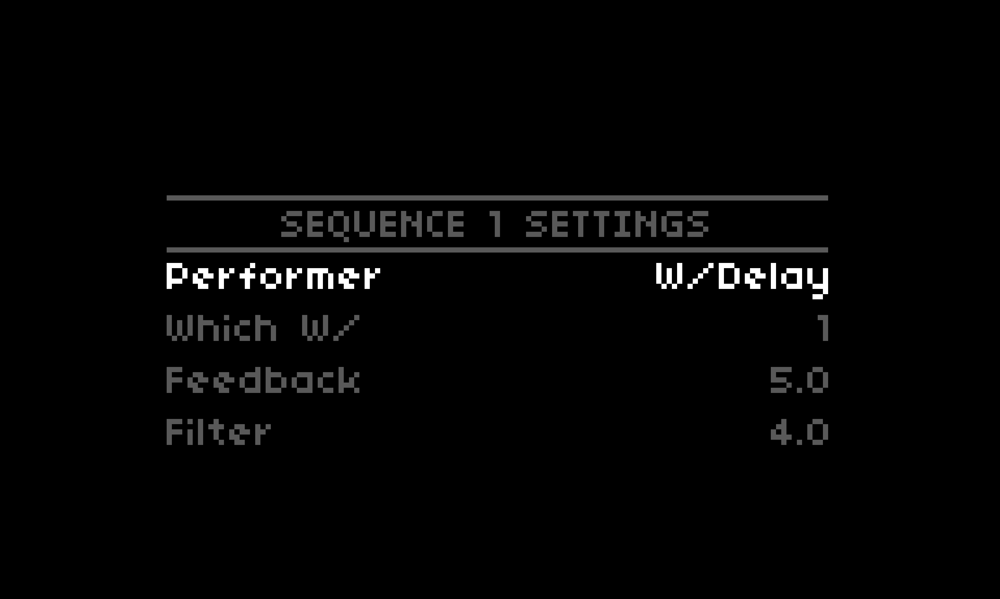

Each sequence has a selectable PERFORMER in params. If you are not using Crow, you will be limited to mx.synths and Midi. If the crow is unavailable when loading a saved state, all i2c performers will default to Midi.

Individual performers have their own params. Some devices allow for addressing. Addressing is not covered by this readme at this time. One note, you could theoretically have six W/ devices accessible on your bus from this script, such that two flavors of W/Synth, W/Delay, and W/Tape are available. At most Five of these would be usable in the script (two synths, two delays, and a tape). Likewise up to five crows might be accessible on your bus, with host being the device connected via USB and 1-4 being attached by i2c.

### Experimental

The W/rong Stop is an additional cat available to enable via params if an i2c bus is present. It makes use of W/Tape, and it is caustic. It creates a loop at timestamp 5000 seconds.

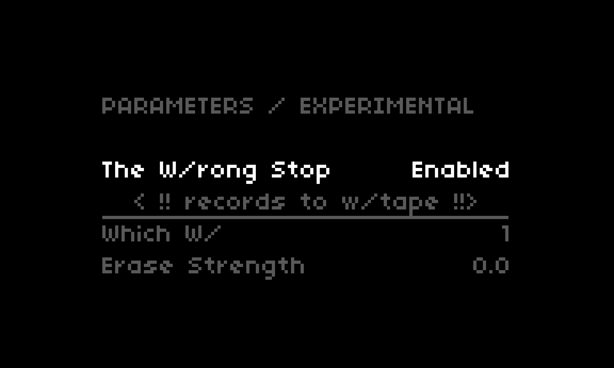

While you can adust the length and scale of the loop, it exists as a chaotic actor. The only way to know a cat you have created will make it act is to disable the cats associated with any of the four primary sequences. Otherwise, it is a matter of chance whether any given cat will have an affinity for w/tape and cause it to perform.

### Acknowledgements 
This sequencer gets its voice from [mx.synths](https://github.com/schollz/mx.synths) and would do very little without it.

Grid diagrams care of [Tyler Etters](https://nor.the-rn.info/about)'s excellent [GridStation](https://tyleretters.github.io/GridStation/)

