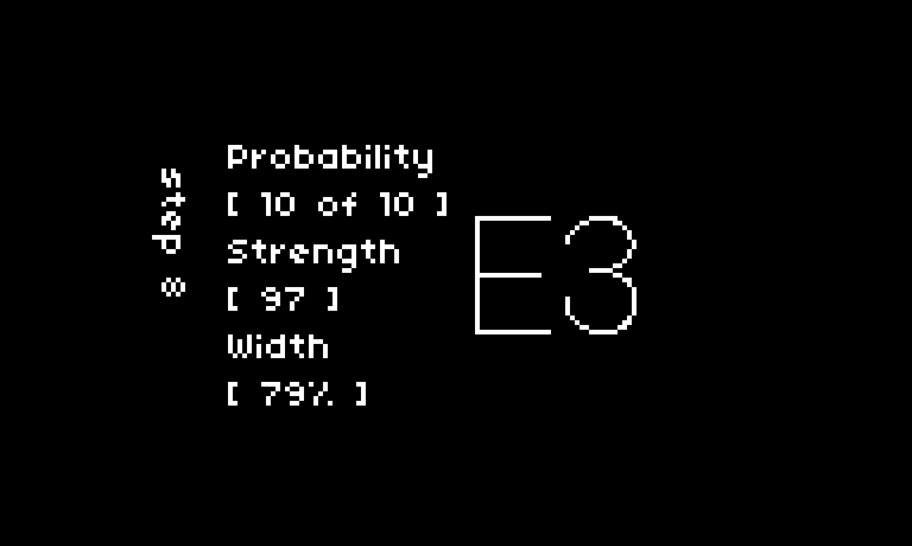

# marcovaldo
a spatial sequencer with cats

## Useage
Marcovaldo is a sequencer for monome norns. It works best with a varibright monome grid, but it isn't required for basic use. Grids of any size will do, with both 64-key and 128-key grids fully supported for direct sequence editing. It's also built with the monome arc in mind, but this is not a requirement to enjoy the script.

### The Arrangement
The collection of four sequences at the heart of Marcovaldo is called its Arrangement. The rings, encoders, keys, and console all serve the Arrangement.

### The Console
Marcovaldo's screen provides both aesthetic and functional value. With an arc and a grid, the console is supplemental and largely unnecessary. As such its DEFAULT mode is animation. There are currently three scenes (mushrooms, wasps, and woodcock) suggested by [the text from which the application is adapted](https://en.wikipedia.org/wiki/Marcovaldo). More will come in time.

If these animations are not your cup of tea (no hard feelings), they can be disabled in Marcovaldo's global params.

This will replace the animations by default with the sequence status view.

You can toggle between animation and sequence status with ENC 1 at any time while in DEFAULT mode (unless animations have been disabled).

There are two edit modes.

SEQUENCE allows for the editing of STEP COUNT (ARC 1 / ENC 2), PULSE COUNT (ARC 2 / ENC 3), OCTAVE RANGE (ARC 3 / K1 + ENC 2), and CLOCK SUBDIVISION (ARC 4 / K1 + ENC 3).

Pulses derived by PULSE COUNT and STEP COUNT are distributed by euclidean distance automatically when these attributes are changed.

From the DEFAULT mode, adjusting an arc or norns encoder will enter its associated sequence. Alternately, from DEFAULT you may enter edit mode on the last edited sequence by pressing K3. K2 will return to the DEFAULT mode.

The selected sequence can be changed using ENC 1.

STEP allows for the editing of NOTE (ARC 1 / ENC 2), PULSE ACTIVE (ARC 2 / ENC 3), PULSE STRENGTH (ARC 3 / K1 + ENC 2), and PULSE WIDTH (ARC 4 / K1 + ENC 3).

PULSE ACTIVE is an override. Adjustments persist when recalculating euclidean beats. PULSE WIDTH is a multiplier applied to the clock/subdivision calculated duration of the sequence's pulse. The range is between 50% anf 150% of the original pulse duration.

From the SEQUENCE mode, pressing K3 will take you to STEP mode. Pressing K2 in STEP mode will return you to the parent sequence.

The selected step can be changed with ENC 1.

### The Chart

While the Arrangement more or less represents the "sequencer" part of Marcovaldo, it also represents the working order of the world. The Chart, on the other hand, reflects a way of observing and interacting with that world.

It's the grid. You don't need it to experience the music, but something is lost without one in your ability to connect to it.

The Chart is divided into four sections. If your grid is a 128-key (16x8), you'll see all four at once. If you're using a 64-key grid (8x8), you'll see one section at a time and can move between them with the page gesture.

For 64-key grids, the page gesture is performed by simultaneously pressing the three keys in the bottom-right corner (positions 7,8 + 8,7 + 8,8). This allows you to navigate between pages while maintaining the same intuitive interface on smaller grid layouts.

Each of the first three Chart plans (RADIATION, PATH, CATS) contains both FEATURES and PHENOMENA. FEATURES are stable aspects of the environment. PHENOMENA represent the ephemera of their affect on the environment. The fourth plan (RELIEF) is only PHENOMENA.

The key distinction is FEATURES can be created or moved or otherwise interacted with. PHENOMENA occur.

The RADIATION plan ("Moon and GNAC") contains the emitters (FEATURES) of the four sequences, illustrating the intensity and frequency of its output (PHENOMENA).

Hold a press on one of the emitters while pressing a new key to change its position. These features cannot be removed, only moved and stopped.

Tap an emitter to enable or disable its associated sequence.

The PATH plan ("The City All to Himself") is the core of the "spatial" claim of this software. Placing markers on this plan (FEATURES) allows Marcovaldo (the observer) to move between them (PHENOMENON). Where Marcovaldo is in space in relation to the various emitters alters the intensity with which he hears their emanations.

New presses automatically add to the tail of his path, however by holding a press on any marker within his path you can inject a new stop from that selected point. Tapping any marker without holding to inject a new one will remove it from the path.

The CATS plan ("The Garden of Stubborn Cats") introduces minor chaos to the orderly world of the arrangement. Tap anywhere to add or remove cats (FEATURES). Each has a variable amount of laziness that will determine the frequency with which it moves (PHENOMENA).

When they walk off the Chart, they're gone for good. When they do move, they modify the characteristics of the sound in that instance. On some occasions these changes will stick. Different voices will reflect these changes differently.

The final plan is the RELIEF ("Smoke, wind, and Soap Bubbles"). It is a collection of all the Chart phenomena layered atop one another. A visualization of how all the pieces fit together with no interactive characteristics.

### Direct Sequence Editing

When in SEQUENCE mode, you can directly edit sequences on the grid. This feature is fully supported on both 64-key and 128-key grids:

- On 128-key grids, you'll see the full sequence laid out across the grid
- On 64-key grids, you'll see a portion of the sequence at a time, with paging functionality to navigate through longer sequences

To edit a sequence:
- Tap a step to toggle its pulse on/off
- Hold a step for one second to enter STEP edit mode for that specific step
- Tap a position beyond the current sequence length to extend the sequence to that length

This direct editing capability allows for intuitive, visual sequence creation and modification without leaving the grid interface.

### Params
SAVING and LOADING from Marcovaldo's global parameter group will save and load not only the feature placements on the chart but also the current state of all params.

The COSMOLOGICAL CONSTANT is a global operand applied to the calculated durations of pulses. It can dramatically alter the feel of your Arrangement. Smaller number equals longer pulse.

If you do not use a grid, the global and sequence parameters are how you must manage transport.

The ADSR params of each sequence are applied as percentage multipliers to the calculated pulse duration of their respective sequence.

### Performers

Marcovaldo supports various hardware interfaces for sound output through its Performer system:

#### Core Performers
- **Mx. Synths**: Controls the internal norns synth engine
- **Midi**: Sends notes to MIDI devices
- **Crow**: Controls the Crow Eurorack module via CV and gate outputs
- **Ansible**: Interfaces with the Monome Ansible Eurorack module
- **Just Friends**: Controls the Make Noise Just Friends module
- **ER-301**: Interfaces with the Orthogonal Devices ER-301 Sound Computer
- **Disting**: Controls the Expert Sleepers Disting module
- **Teletype**: Interfaces with the Monome Teletype module

#### Whimsical Raps Series
- **W/Delay**: Interfaces with the Whimsical Raps Delay module, providing time-based effects with parameters for feedback, mix, filter, and modulation
- **W/Synth**: Controls the Whimsical Raps Synth module with FM synthesis capabilities, offering parameters for curve, ramp, FM index, FM envelope, and FM ratio
- **W/Tape**: Interfaces with the Whimsical Raps Tape module, providing tape-based manipulation of sound with recording, playback control, and looping functionality

Each performer has its own set of parameters that can be configured in the parameters menu, allowing for extensive customization of your sound output.

### Acknowledgements 
This sequencer gets its voice from [mx.synths](https://github.com/schollz/mx.synths) and would do very little without it.

Grid diagrams care of [Tyler Etters](https://nor.the-rn.info/about)'s excellent [GridStation](https://tyleretters.github.io/GridStation/)
